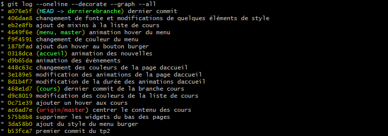

# TP2

Les cours que j'ai modifié sont les suivants :

- Environnement professionnel (TIM-111)
- Animation (TIM-121)
- Image numérique 1 (TIM-122)
- Design graphique 1 (TIM-131)
- Création Web (TIM-151)

Les principales modifications du style se sont faites dans les fichiers _accueil.scss, _menu-main-navigation.scss, et _liste-cours.scss.

Les principales modifications des animations se sont faits dans les fichiers _anim-header.scss et _accueil.scss.

# Capture d'écran

